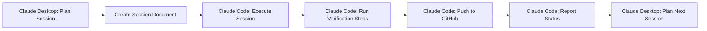

# Bara-v1: Two-Actor Development Model

## Overview
This project uses a two-actor development model with Session-based implementation:

1. **Claude Desktop** (Strategy & Planning)
2. **Claude Code** (Implementation & Verification)

## Key Principles

### 1. Session-Based Development
- **NO weekly milestones** - only Sessions
- Each Session is ~45 minutes
- Designed to fit within Claude's context window
- Prevents auto-compaction issues

### 2. Actor Responsibilities

#### Claude Desktop (Current Role)
- Architecture and system design
- Creating Session definitions
- Strategic planning
- Documentation
- Post-Session integration

#### Claude Code (Implementation)
- Executes Session definitions
- Writes actual code
- Runs verification in parallel terminal
- Reports back completion status

### 3. Session Workflow



**Note**: Verification is now included as part of the session execution steps, not a separate process.

### 4. Session Document Structure

Each Session document contains:
- **Metadata**: Session number, title, duration
- **Objectives**: Clear, measurable goals
- **Context**: Current state and dependencies
- **Implementation Steps**: Detailed instructions (including verification)
- **Success Criteria**: Checklist for completion
- **Handoff Format**: Status report structure

### 5. Integrated Verification

Claude Code runs verification as part of the session:
```bash
# Standard verification steps included in each session
npm run dev          # Ensure it runs
npm run build        # Ensure it builds
npm run type-check   # TypeScript validation
npm test            # Run tests if available
```

Verification is no longer a separate step - it's integrated into the implementation flow.

### 6. Session Boundaries

Sessions end when:
- 45 minutes have elapsed
- Objectives are complete
- Context window is near capacity
- A natural breakpoint is reached

### 7. Communication Protocol

#### Desktop → Code
```json
{
  "session": 1,
  "objectives": [...],
  "context": {...},
  "dependencies": [...]
}
```

#### Code → Desktop  
```json
{
  "session": 1,
  "status": "complete",
  "implemented": [...],
  "verified": true,
  "nextSession": 2
}
```

## Current Project Status

### Completed by Claude Desktop:
- ✅ System architecture
- ✅ Database schema design
- ✅ UI/UX design in Figma
- ✅ Feature specifications
- ✅ Session-based roadmap
- ✅ Session 1 definition ready

### Ready for Claude Code:
- 🔲 Session 1: Project Setup & Authentication
- 🔲 Session 2: Database Schema & RLS
- 🔲 Session 3: Layout Components
- ... (30+ Sessions planned)

## Important Notes

1. **Context Preservation**: Each Session document preserves context for the next
2. **No Assumptions**: Claude Code should not assume prior knowledge beyond the Session document
3. **Integrated Verification**: Every Session includes verification steps as part of implementation
4. **Clean Handoffs**: Status reports ensure smooth transitions between actors
5. **Git Integration**: Each Session ends with committing and pushing to GitHub

## Getting Started with Claude Code

1. Open `/sessions/session-XX-description.md`
2. Use the standard prompt with permissions:
   ```
   For this session, you have permission to:
   - Create all files and directories
   - Run all npm/npx commands
   - Install all packages
   - Modify any files in the project
   - Execute git commands
   - Run the development server
   
   Please proceed with Session X without asking for individual approvals.
   ```
3. Execute all implementation steps
4. Run verification commands
5. Report completion status
6. Claude Desktop will provide next Session

This model ensures efficient development within Claude's constraints while maintaining high code quality and clear communication between planning and implementation phases.
