# Bara-v1: Two-Actor Development Model

## Overview
This project uses a two-actor development model with Session-based implementation:

1. **Claude Desktop** (Strategy & Planning)
2. **Claude Code** (Implementation & Verification)

## Key Principles

### 1. Session-Based Development
- **NO weekly milestones** - only Sessions
- Each Session is **~90 minutes** (UPDATED: doubled from 45)
- Combines two related feature sets
- Designed to maximize Claude's context window
- Prevents auto-compaction issues

### 2. Actor Responsibilities

#### Claude Desktop (Current Role)
- Architecture and system design
- Creating Session definitions
- Strategic planning
- Documentation
- Post-Session integration
- **CRITICAL**: Context analysis before each session
- **CRITICAL**: Always provide complete Claude Code prompts
- **CRITICAL**: Include project path at top of every prompt
- **CRITICAL**: Include push notification setup in all sessions

#### Claude Code (Implementation)
- Executes Session definitions
- Writes actual code
- Runs verification in parallel terminal
- Reports back completion status

### 3. Session Workflow

```mermaid
graph LR
    A[Read Previous Session Status] --> B[Analyze Context Usage]
    B --> C[Claude Desktop: Plan Session]
    C --> D[Create Session Document]
    D --> E[Provide Complete Claude Code Prompt]
    E --> F[Claude Code: Execute Session]
    F --> G[Claude Code: Run Verification Steps]
    G --> H[Claude Code: Send Push Notification]
    H --> I[Claude Code: Push to GitHub]
    I --> J[Claude Code: Report Status]
    J --> K[Claude Desktop: Plan Next Session]
```



**CRITICAL REQUIREMENTS**:
1. **Context Analysis**: Always read previous session status before planning
2. **Complete Prompts**: Always provide full Claude Code prompt for copy/paste
3. **Project Path**: Always include cd command at top of prompt
4. **Push Notifications**: Every session ends with notification to user
5. **Verification**: Integrated into session execution steps

### 4. Session Document Structure

Each Session document contains:
- **Metadata**: Session number, title, duration
- **Objectives**: Clear, measurable goals
- **Context**: Current state and dependencies
- **Implementation Steps**: Detailed instructions (including verification)
- **Success Criteria**: Checklist for completion
- **Handoff Format**: Status report structure

### 5. Integrated Verification

Claude Code runs verification as part of the session:
```bash
# Standard verification steps included in each session
npm run dev          # Ensure it runs
npm run build        # Ensure it builds
npm run type-check   # TypeScript validation
npm test            # Run tests if available
```

Verification is no longer a separate step - it's integrated into the implementation flow.

### 6. Session Boundaries

Sessions end when:
- Target time has elapsed (adjusted based on previous context usage)
- Objectives are complete
- Context window is near capacity
- A natural breakpoint is reached
- **IMPORTANT**: Session scope must be pre-adjusted based on previous context analysis

### 7. Communication Protocol

#### Desktop → Code
```json
{
  "session": 1,
  "objectives": [...],
  "context": {...},
  "dependencies": [...]
}
```

#### Code → Desktop  
```json
{
  "session": 1,
  "status": "complete",
  "implemented": [...],
  "verified": true,
  "nextSession": 2
}
```

## Current Project Status

### Completed by Claude Desktop:
- ✅ System architecture
- ✅ Database schema design
- ✅ UI/UX design in Figma
- ✅ Feature specifications
- ✅ Session-based roadmap (18 double sessions)
- ✅ Session 1 definition ready
- ✅ Session restructuring to double sessions

### Ready for Claude Code:
- ✅ Session 1: Project Setup & Authentication (COMPLETE)
- 🔲 Session 2: Database Schema & Layout Components
- 🔲 Session 3: Task System & Keyboard Navigation  
- 🔲 Session 4: Projects & Tags System
- ... (18 total double sessions)

## CRITICAL GLOBAL REQUIREMENTS (ALL SESSIONS)

### 1. MANDATORY Context Analysis Process
**Before planning ANY session**, Claude Desktop MUST:
```bash
# 1. Read previous session status
read_file("/sessions/session-[N-1]-status.json")

# 2. Analyze context usage:
- Previous context used: X%
- Auto-compact triggered: yes/no
- Recommendation: optimal/too large/too small

# 3. Adjust upcoming session scope:
- If previous >60% context: REDUCE scope by 20%
- If previous 40-60% context: MAINTAIN scope (optimal)
- If previous <40% context: INCREASE scope by 10%
- If auto-compact triggered: REDUCE scope by 30%
```

### 2. MANDATORY Complete Claude Code Prompts
**Every session planning MUST include**:
- ✅ Project path at the very top of prompt
- ✅ Complete prompt text for copy/paste
- ❌ NEVER reference external scripts like `./launch-session.sh`
- ❌ NEVER say "use the standard prompt"
- ✅ Full autonomous permission statement
- ✅ All implementation steps detailed
- ✅ Context tracking requirements
- ✅ Push notification command

### 3. MANDATORY Push Notification Setup
**Every session completion MUST include**:
```bash
# Command that Claude Code executes at session end:
../../claude-notify.sh '[PROJECT] Session [N]: [TITLE] Complete' [N]
```

## Important Notes

1. **Context Preservation**: Each Session document preserves context for the next
2. **No Assumptions**: Claude Code should not assume prior knowledge beyond the Session document
3. **Integrated Verification**: Every Session includes verification steps as part of implementation
4. **Clean Handoffs**: Status reports ensure smooth transitions between actors
5. **Git Integration**: Each Session ends with committing and pushing to GitHub
6. **CRITICAL**: All three global requirements above apply to EVERY session in EVERY project

## UPDATED Session Planning Checklist

### Before Planning ANY Session (Claude Desktop):
- [ ] Read previous session status JSON file
- [ ] Analyze context usage and auto-compact status
- [ ] Adjust session scope based on context analysis
- [ ] Create session document with appropriate scope
- [ ] Include project path cd command at top of prompt
- [ ] Include push notification command in completion steps

### Session Execution (Claude Code):
- [ ] Execute all implementation steps
- [ ] Run verification commands
- [ ] Send push notification on completion
- [ ] Commit and push to GitHub
- [ ] Report completion status with context metrics

### Global Template for Claude Code Prompts:
```
cd /Volumes/DevDrive/ClaudeProjects/active/[PROJECT-NAME]

LAUNCH COMMAND: claude --dangerously-skip-permissions

AUTONOMOUS EXECUTION MODE ACTIVE - NO PERMISSION REQUESTS ALLOWED

You have COMPLETE AUTONOMOUS PERMISSION for all operations.

[SESSION DETAILS]
[IMPLEMENTATION STEPS]
[CONTEXT TRACKING]
[COMPLETION REQUIREMENTS INCLUDING PUSH NOTIFICATION]
```

This model ensures efficient development within Claude's constraints while maintaining high code quality, proper context management, and clear communication between planning and implementation phases.
