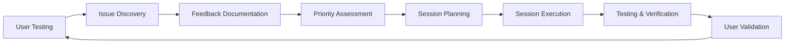

# Bara-v1: User Feedback Collection Template
## Systematic Issue Tracking and Enhancement Requests

### 🐛 **Bug Report Template**
```markdown
## Bug Report: [Brief Description]

**Bug ID**: BR-[YYYY-MM-DD]-[###]
**Date**: [Date]
**Priority**: Critical / High / Medium / Low
**Status**: New / In Progress / Testing / Resolved

### Issue Details
- **Component/Feature**: [Tasks, Projects, Navigation, etc.]
- **Device/Browser**: [iOS Safari, Chrome Desktop, etc.]
- **User Action**: [What were you trying to do?]
- **Expected Result**: [What should have happened?]
- **Actual Result**: [What actually happened?]

### Steps to Reproduce
1. [First step]
2. [Second step]
3. [Third step]
4. [Bug occurs]

### Screenshots/Videos
- [Attach visual evidence]
- [Include console errors if technical]

### Additional Context
- **Frequency**: Always / Sometimes / Rarely
- **Workaround**: [Is there a way to work around this?]
- **Impact**: [How does this affect your productivity?]

### Technical Notes (if applicable)
- Console errors: [Copy any error messages]
- Network issues: [API failures, timeouts]
- Performance: [Slow loading, freezing]
```

---

### ✨ **Enhancement Request Template**
```markdown
## Enhancement Request: [Brief Description]

**Request ID**: ER-[YYYY-MM-DD]-[###]
**Date**: [Date]
**Priority**: High / Medium / Low
**Status**: New / Planned / In Progress / Complete

### Enhancement Details
- **Component/Feature**: [What part of the app?]
- **Current Behavior**: [How does it work now?]
- **Desired Behavior**: [How should it work?]
- **Use Case**: [When would you use this?]

### Detailed Description
[Provide a detailed explanation of the enhancement]

### Benefits
- **Productivity**: [How will this improve your workflow?]
- **User Experience**: [How will this make the app better to use?]
- **Efficiency**: [Will this save time or reduce clicks?]

### Acceptance Criteria
- [ ] [Specific requirement 1]
- [ ] [Specific requirement 2]
- [ ] [Specific requirement 3]

### Design Considerations
- **UI/UX Impact**: [Will this require interface changes?]
- **Mobile Considerations**: [How should this work on mobile?]
- **Accessibility**: [Any accessibility requirements?]
- **Performance**: [Any performance considerations?]

### Priority Justification
**Why is this important?**
[Explain why this enhancement should be prioritized]
```

---

### 🎨 **UI/UX Feedback Template**
```markdown
## UI/UX Feedback: [Component/Page Name]

**Feedback ID**: UX-[YYYY-MM-DD]-[###]
**Date**: [Date]
**Type**: Visual / Interaction / Layout / Typography / Color
**Priority**: High / Medium / Low

### Current State
- **Component**: [Button, form, navigation, etc.]
- **Page/Context**: [Where in the app]
- **Current Design**: [Screenshot of current state]

### Issue Description
- **Problem**: [What feels wrong or confusing?]
- **User Impact**: [How does this affect usability?]
- **Frequency**: [How often do you encounter this?]

### Proposed Solution
- **Suggested Change**: [What would improve this?]
- **Visual Reference**: [Link to inspiration, mockup, or Figma]
- **Interaction Changes**: [How should it behave differently?]

### Design Specifications (if known)
- **Colors**: [Specific color preferences]
- **Spacing**: [Padding, margins, layout changes]
- **Typography**: [Font size, weight, style changes]
- **Animation**: [Transition or animation preferences]

### Context
- **Device Usage**: [Desktop, mobile, tablet]
- **Usage Frequency**: [Daily, weekly, occasional]
- **Workflow Impact**: [How does current design slow you down?]

### Figma Integration
- **Figma Link**: [Link to relevant Figma designs]
- **Component Updates Needed**: [List Figma components to modify]
- **Design System Impact**: [Will this affect other components?]
```

---

### 🔄 **Session Request Template**
```markdown
## Development Session Request

**Session ID**: SR-[YYYY-MM-DD]-[###]
**Date**: [Date]
**Requested Completion**: [Timeframe]

### Session Type
- [ ] Bug Fix (15-30 min)
- [ ] UI/UX Refinement (30-60 min)
- [ ] Feature Enhancement (45-60 min)
- [ ] New Feature (60-90 min)
- [ ] Maintenance (30-45 min)

### Issues to Address
**Primary Issues** (must be completed):
- [List main items with IDs: BR-2025-06-17-001, ER-2025-06-17-002]

**Secondary Issues** (if time permits):
- [List additional items that could be included]

### Success Criteria
- [ ] [Specific outcome 1]
- [ ] [Specific outcome 2]
- [ ] [Specific outcome 3]

### Testing Plan
- **Manual Testing**: [What you'll test after session]
- **Regression Testing**: [Areas to check for unintended changes]
- **User Acceptance**: [How you'll validate the fixes]

### Priority Justification
[Why should this session be prioritized?]
```

---

### 📊 **Feedback Prioritization Matrix**

#### **Critical Priority** (Immediate Session Required)
- Application crashes or becomes unusable
- Data loss or corruption
- Security vulnerabilities
- Core productivity features broken

#### **High Priority** (Next Session)
- Daily workflow significantly impacted
- User frequently encounters frustrating issues
- Features that are confusing or hard to use
- Performance problems affecting productivity

#### **Medium Priority** (Upcoming Sessions)
- Quality of life improvements
- Nice-to-have UI/UX enhancements
- Minor bugs that have workarounds
- Features that work but could be better

#### **Low Priority** (Backlog)
- Cosmetic improvements
- Edge case scenarios
- Advanced features for power users
- Performance optimizations (non-critical)

---

### 🎯 **Weekly Feedback Review Process**

#### **Monday: Feedback Triage**
1. **Collect**: Gather all feedback from the past week
2. **Categorize**: Sort into bugs, enhancements, UI/UX issues
3. **Prioritize**: Apply priority matrix
4. **Plan**: Determine session types and schedule

#### **Session Planning Template**:
```markdown
## Weekly Session Plan: [Week of Date]

### Critical Issues (Must Address)
- [List critical items requiring immediate attention]

### High Priority Sessions Planned
**Session 1**: [Type] - [Duration] - [Main Issues]
- Primary: [Issue IDs and descriptions]
- Success criteria: [What needs to be achieved]

**Session 2**: [Type] - [Duration] - [Main Issues]
- Primary: [Issue IDs and descriptions]  
- Success criteria: [What needs to be achieved]

### Medium Priority (If Time Permits)
- [List items that could be included in sessions if scope allows]

### Low Priority Backlog
- [Items to consider for future weeks]

### User Testing Plan
- **Focus Areas**: [What to test after sessions complete]
- **Testing Duration**: [How long to test before next feedback cycle]
- **Success Metrics**: [How to measure improvement]
```

---

### 🔧 **Feedback Implementation Workflow**



#### **Feedback Loop Timing**:
- **Daily**: Quick feedback notes during usage
- **Weekly**: Formal feedback review and session planning
- **Bi-weekly**: Comprehensive testing and validation cycles
- **Monthly**: Overall satisfaction and roadmap adjustment

This systematic approach ensures that your feedback is captured effectively, prioritized appropriately, and addressed efficiently through our enhanced session-based development model.
