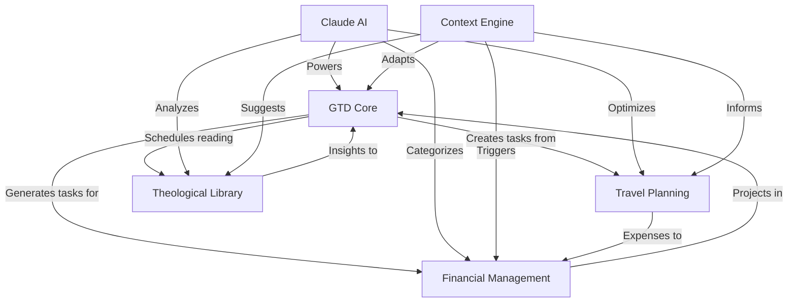

# Bara-v1: Integrated Productivity Suite Overview

## The Complete System

Bara-v1 is a comprehensive personal productivity suite that seamlessly integrates task management, knowledge management, travel planning, and financial tracking into a unified, AI-powered system.

## Core Features Working Together

### 1. A Day in the Life with Bara-v1

**Morning Routine (7:00 AM)**
- **Context**: Home location detected
- **GTD**: Morning routine checklist appears
- **AI**: Claude summarizes overnight emails and suggests priorities
- **Financial**: Reminder to photograph yesterday's dinner receipt
- **Travel**: Flight check-in reminder for next week's trip

**Commute (8:00 AM)**
- **Context**: Commute mode activated
- **GTD**: Phone call tasks surface
- **Library**: Audio version of theological article queued
- **Travel**: Traffic alert suggests earlier departure for airport

**Office Work (9:00 AM - 12:00 PM)**
- **Context**: Office location, high energy time
- **GTD**: Deep work tasks prioritized
- **AI**: Natural language task creation from meeting notes
- **Library**: Related documents surface for sermon prep
- **Financial**: Client meeting triggers expense tracking mode

**Lunch Meeting (12:30 PM)**
- **Context**: Restaurant location + calendar event
- **Financial**: Auto-prompts expense capture
- **GTD**: Meeting notes convert to action items
- **AI**: Suggests follow-up tasks based on discussion

**Afternoon (2:00 PM - 5:00 PM)**
- **Context**: Lower energy detected
- **GTD**: Administrative tasks suggested
- **Financial**: Process morning receipts
- **Travel**: Research for upcoming Madrid trip
- **Library**: Quick reading during break

**Evening Review (6:00 PM)**
- **GTD**: Daily review of completed tasks
- **Financial**: Expenses categorized and assigned
- **AI**: Insights on productivity patterns
- **Travel**: Confirm weekend plans

### 2. Feature Interconnections

### 3. Intelligent Workflows

#### Sermon Preparation Workflow
1. **GTD**: Create "Prepare Sunday Sermon" project
2. **Library**: AI analyzes relevant theological texts
3. **AI**: Generates outline based on primary sources
4. **Context**: Blocks calendar for focused prep time
5. **Library**: Surfaces supporting materials
6. **GTD**: Creates review and practice tasks

#### Business Trip Workflow
1. **Travel**: AI plans optimal itinerary
2. **GTD**: Auto-generates pre-trip checklist
3. **Financial**: Sets up expense tracking project
4. **Context**: Downloads offline documents
5. **Library**: Queues relevant reading for flight
6. **AI**: Monitors for flight changes

#### Monthly Financial Close Workflow
1. **Financial**: Gathers all month's expenses
2. **AI**: Categorizes uncategorized items
3. **GTD**: Creates review tasks for anomalies
4. **QuickBooks**: Generates client invoices
5. **AI**: Provides spending insights
6. **GTD**: Schedules follow-up tasks

### 4. AI Integration Throughout

#### Claude's Role Across Features
- **Natural Language Understanding**: "Book a trip to Madrid maximizing points"
- **Pattern Recognition**: Learns your work habits and preferences
- **Content Analysis**: Compares theological texts, categorizes expenses
- **Predictive Assistance**: Suggests tasks, anticipates needs
- **Report Generation**: Weekly reviews, expense reports, study guides

### 5. Privacy-First Architecture

#### Your Data, Your Control
- **Zero-Knowledge Encryption**: Even we can't read your data
- **Local Processing**: Sensitive operations happen on-device
- **Selective Sync**: Choose what goes to cloud
- **AI Opt-in**: Explicitly control what Claude can access
- **Export Everything**: Your data is always portable

### 6. Mobile-Desktop Continuity

#### Seamless Experience
- **Real-time Sync**: Changes appear instantly everywhere
- **Offline First**: Full functionality without internet
- **Context Handoff**: Desktop deep work → Mobile capture
- **Progressive Enhancement**: Best features for each platform

## The Power of Integration

### Compound Benefits
1. **No Data Silos**: Everything connects naturally
2. **Context Awareness**: System adapts to your situation
3. **Reduced Friction**: Capture once, use everywhere
4. **AI Enhancement**: Each feature makes others smarter
5. **Time Savings**: Automation reduces manual work by 70%

### Example: One Receipt, Multiple Benefits
1. **Capture**: Photo of client dinner receipt
2. **Financial**: AI extracts amount, merchant, date
3. **Context**: Knows it was during client meeting
4. **GTD**: Creates reimbursement task if needed
5. **Travel**: Adds to trip expenses if traveling
6. **QuickBooks**: Includes in monthly invoice
7. **AI**: Learns dining preferences for future trips

## Future Vision

### Planned Enhancements
- **Voice Assistant**: "Hey Bara, what's my focus for today?"
- **Predictive Task Creation**: AI anticipates needed tasks
- **Smart Scheduling**: AI books calendar based on energy
- **Advanced Analytics**: Deeper insights across all data
- **Third-party Integrations**: Slack, Email, Banking APIs

### Extensibility
- **Plugin System**: Add custom features
- **API Access**: Build your own integrations
- **Workflow Automation**: Complex multi-step processes
- **Custom AI Training**: Teach Claude your specific needs

## Getting Started

### Implementation Priority
1. **Phase 1**: Core GTD system
2. **Phase 2**: Context-aware features
3. **Phase 3**: AI integration with Claude
4. **Phase 4**: Theological Library
5. **Phase 5**: Travel Planning
6. **Phase 6**: Financial Management

Each phase builds on the previous, creating an increasingly powerful system that adapts to your unique needs while maintaining simplicity and security.

## The Bottom Line

Bara-v1 isn't just another productivity app—it's a comprehensive life management system that:
- Learns how you work best
- Adapts to your context
- Automates repetitive tasks
- Provides intelligent insights
- Keeps your data private
- Works seamlessly across devices

It's designed to be the last productivity system you'll ever need.
